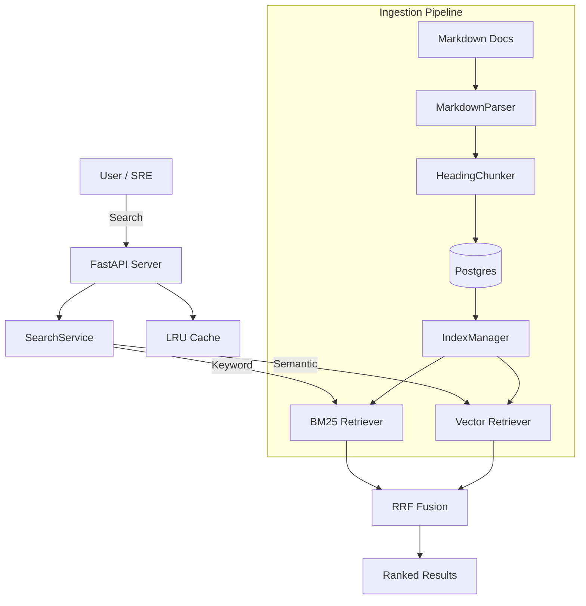

# [RunbookQuery](https://runbook-query.vercel.app/)

**Hybrid Search for SRE & On-Call Engineering**

RunbookQuery is a specialized search engine designed for SREs to quickly find relevant troubleshooting documentation, runbooks, and GitHub issues. It combines **BM25** (keyword matching) with **Semantic Search** (vector embeddings) using **Reciprocal Rank Fusion (RRF)** to deliver high-quality results even when queries use different terminology than the documentation.


## Features

- **Hybrid Search**: Combines BM25 and Vector Search (sentence-transformers + FAISS) for superior relevance.
- **Smart Ingestion**: 
    - Markdown connector with front-matter support.
    - Intelligent chunking based on headings.
- **Performance**:
    - LRU Query Cache for sub-10ms repeated searches.
    - Low-latency API (~15ms p99 for cached, ~150ms uncached).
- **Observability**:
    - Prometheus metrics at `/metrics`.
    - Structured logging with `structlog`.
- **Evaluation Harness**:
    - Automated benchmarking script to measure MRR, nDCG, and Recall.
- **Modern UI**:
    - React + Vite-based dark mode interface.

## Architecture



## Quick Start

### Prerequisites
- Python 3.11+
- Node.js 20+

### Installation

1. **Clone and Install**
   ```bash
   git clone https://github.com/almastelek/RunbookQuery.git
   cd RunbookQuery
   pip install -e ".[dev]"
   ```

2. **Ingest Documentation**
   ```bash
   # Ingest sample docs provided in the repo
   python3 -m runbook_query.cli ingest --source ./sample_docs --name kubernetes
   ```

3. **Build Indexes**
   ```bash
   # Builds both BM25 and Vector indexes
   python3 -m runbook_query.cli build-index
   ```

4. **Start the API Server**
   ```bash
   python3 -m runbook_query.cli serve
   ```
   The API will be available at `http://localhost:8000`.

5. **Start the UI**
   ```bash
   cd frontend
   npm install
   npm run dev
   ```
   Access the UI at `http://localhost:5173`.

## Usage

### CLI Search
You can search directly from the command line:
```bash
python3 -m runbook_query.cli search "pod crash loop"
```

### Evaluation
Run the evaluation harness to benchmark search performance:
```bash
python3 -m runbook_query.evaluation.runner
```
*Current Benchmark Results:*
- **MRR**: 0.933
- **nDCG@10**: 0.951
- **Recall@10**: 1.000

### Metrics
Prometheus metrics are available at `http://localhost:8000/metrics`.
Key metrics:
- `search_requests_total`: Total search count.
- `search_latency_seconds`: Latency histogram.
- `search_cache_hits_total`: Cache efficiency.

## Development

### Project Structure
- `src/runbook_query/api`: FastAPI application.
- `src/runbook_query/retrieval`: Search algorithms (BM25, Vector, Hybrid).
- `src/runbook_query/ingestion`: Data connectors and pipeline.
- `src/runbook_query/evaluation`: Benchmarking tools.
- `frontend/`: React application.

### Running Tests
```bash
pytest
```
